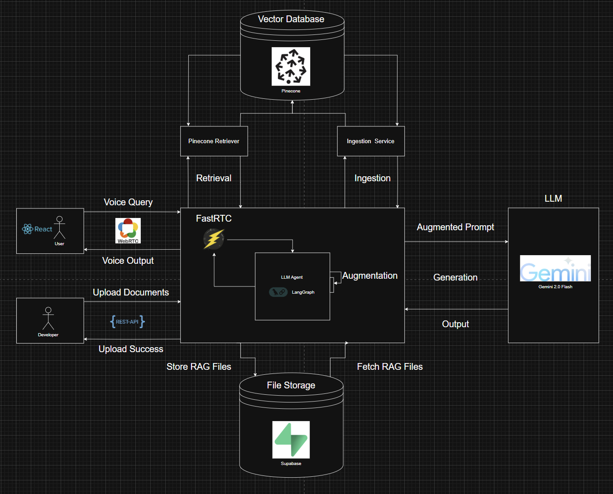
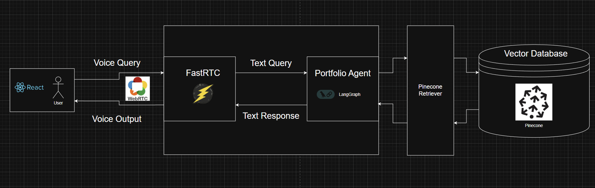
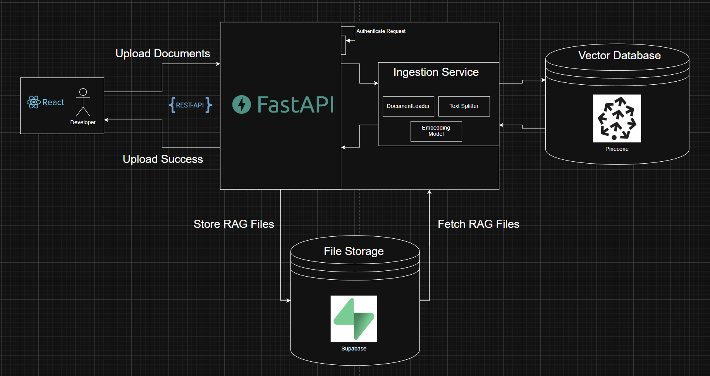

# Portfolio Backend

A FastAPI-based backend service for my portfolio website featuring voice-enabled Retrieval Augmented Generation (RAG) capabilities.

## High-Level Architecture

The system facilitates real-time voice interactions through a sophisticated RAG pipeline. Users can interact with Nova, the portfolio assistant, through voice queries that are processed by a central FastRTC component orchestrating interactions with a Large Language Model (Gemini 2.0 Flash), augmented with information retrieved from a Vector Database (Pinecone) and File Storage (Supabase).



### Core Components

- **FastRTC**: Central orchestration service handling real-time voice communication
- **Portfolio Agent (Nova)**: LangGraph-powered agent for intelligent response generation
- **LLM (Gemini 2.0 Flash)**: Large Language Model for natural language processing
- **Vector Database (Pinecone)**: Stores document embeddings for semantic search
- **File Storage (Supabase)**: Stores original documents and RAG files
- **WebRTC**: Real-time communication protocol for voice streaming

## User Flow

The voice interaction flow enables seamless communication between users and the portfolio agent through WebRTC, with RAG augmentation providing context-aware responses.



### Flow Description

1. **User Voice Input**: User speaks through the React frontend
2. **WebRTC Processing**: Voice is captured and transmitted via WebRTC
3. **FastRTC Orchestration**: Audio is processed and converted to text
4. **Portfolio Agent**: LangGraph agent processes the query with RAG augmentation
5. **Pinecone Retrieval**: Relevant context is retrieved from vector database
6. **LLM Generation**: Gemini generates context-aware responses
7. **Voice Output**: Response is converted to speech and streamed back to user

## Ingestion Flow

The document ingestion pipeline allows developers to securely upload and process documents for RAG capabilities.



### Security Features

- **HMAC Authentication**: All uploads require `x-portfolio-signature` header
- **Developer-Only Access**: Restricted to authorized developers
- **PDF Support**: Currently supports PDF document format

### Ingestion Process

1. **Document Upload**: Developer uploads PDF via React frontend
2. **API Authentication**: FastAPI validates HMAC signature
3. **Document Processing**: Ingestion service processes the document
4. **Vector Storage**: Document chunks are embedded and stored in Pinecone
5. **File Storage**: Original document is stored in Supabase
6. **Success Notification**: Upload confirmation is sent to developer

## Setup Instructions

### 1. Environment Variables

Create a `.env` file with the following variables:

```env
# Application Environment (Options: development, staging, production)
ENVIRONMENT=development

# Application Settings
APP_NAME=PORTFOLIO
APP_VERSION=0.0.1
APP_PORT=8000
APP_SECRET_MESSAGE=
APP_SECRET_KEY=

# Agent Settings
AGENT_ID=gemini-2.0-flash-001
AGENT_TOP_P=0.95
AGENT_TOP_K=40
AGENT_TEMPERATURE=0.1
AGENT_MAX_TOKENS=2048

# Google Settings
GOOGLE_API_KEY=

# CORS Settings
CORS_ORIGINS='["http://localhost","http://localhost:5173", "deployed-frontend-url"]'

# LangSmith Settings
LANGSMITH_TRACING=true
LANGSMITH_ENDPOINT=https://api.smith.langchain.com
LANGSMITH_API_KEY=
LANGSMITH_PROJECT=portfolio

# Cloudflare Settings
CLOUDFLARE_API_KEY=

# Turn Server Settings
TURN_KEY_ID=
TURN_KEY_API_TOKEN=

# Pinecone Settings
PINECONE_API_KEY=
PINECONE_INDEX_NAME=portfolio-index

# AWS Settings
AWS_ACCESS_KEY_ID=
AWS_SECRET_ACCESS_KEY=
AWS_REGION=us-west-2

# Embedding Model Settings
EMBEDDING_MODEL_ID=amazon.titan-embed-text-v2:0

# Supabase Settings
SUPABASE_URL=
SUPABASE_SERVICE_KEY=
SUPABASE_STORAGE_BUCKET_NAME=rag

# FastRTC Settings
FASTRTC_INPUT_SAMPLING_RATE=16000
FASTRTC_OUTPUT_SAMPLING_RATE=24000
FASTRTC_SESSION_TIME_LIMIT=900
FASTRTC_AUDIO_CHUNK_DURATION=0.6
FASTRTC_STARTED_TALKING_THRESHOLD=0.2
FASTRTC_SPEECH_THRESHOLD=0.1
```

### 2. Install Dependencies

```bash
# Using uv (recommended)
uv sync

# Or using pip
pip install -r requirements.txt
```

### 3. Run the Application

```bash
uvicorn app.main:app --host 0.0.0.0 --port 8000
```

## API Endpoints

### Health Check

#### `GET /api/v1/healthy`

Returns the application health status.

**Response:**

```json
{
  "status": "Healthy"
}
```

### Portfolio Agent

#### `POST /api/v1/portfolio-agent/turn-credentials`

Generates TURN server credentials for WebRTC connections.

**Parameters:**

- `ttl` (optional): Time to live for credentials in seconds (default: 900 = 15 minutes)

**Response:**

```json
{
  "iceServers": [
    {
      "urls": "turn:...",
      "username": "...",
      "credential": "..."
    }
  ]
}
```

### Ingestion

#### `POST /api/v1/ingestion/upload`

Uploads and ingests a PDF file into the RAG system.

**Headers:**

- `x-portfolio-signature`: HMAC signature for request authentication

**Body:**

- `file`: PDF file to upload (multipart/form-data)

**Response:**

```json
{
  "message": "File uploaded and ingested successfully"
}
```

### Voice Stream

#### `GET /stream`

WebRTC voice interface endpoint for real-time voice communication with Nova, the portfolio assistant.

**Features:**

- Real-time voice input/output
- Automatic speech-to-text conversion
- Context-aware responses using RAG
- Text-to-speech synthesis
- 15-minute session time limit
- Push-to-talk functionality

## Development

### Project Structure

```bash
app/
├── business/
│   ├── agents/           # Portfolio agent implementation
│   ├── clients/          # External service clients
│   ├── services/         # Business logic services
│   └── prompt_templates/ # LLM prompt templates
├── config/               # Configuration and settings
├── presentation/         # API layer and routing
│   ├── routers/          # API endpoint definitions
│   ├── schemas/          # Request/response models
│   └── middleware/       # HTTP middleware
└── main.py              # Application entry point
```

### Key Technologies

- **FastAPI**: Modern web framework for building APIs
- **FastRTC**: Real-time communication for voice streaming
- **LangGraph**: Framework for building LLM applications
- **Pinecone**: Vector database for semantic search
- **Supabase**: File storage and database
- **Gemini 2.0 Flash**: Google's latest LLM for text generation
- **WebRTC**: Real-time communication protocol

## Security

- HMAC signature validation for document uploads
- CORS configuration for frontend access control
- Environment-based configuration management
- Secure API key management

## Deployment

The application can be deployed using Docker:

```bash
docker build -t portfolio-backend .
docker run -p 8000:8000 portfolio-backend
```

For production deployment, ensure all environment variables are properly configured and the application is served behind a reverse proxy with SSL termination.
